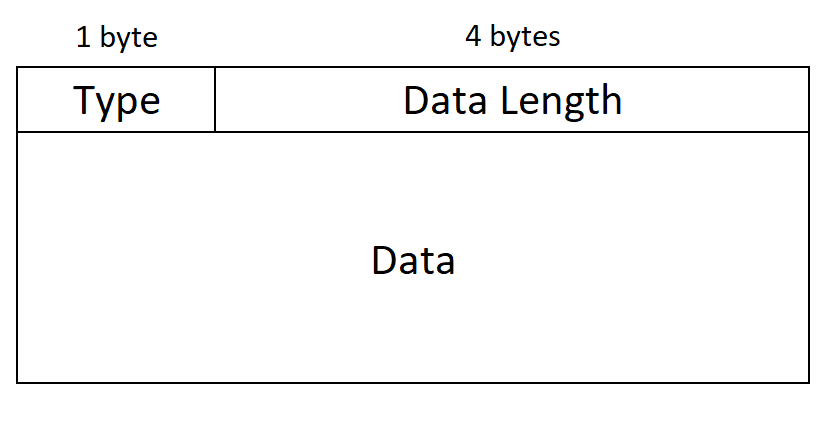
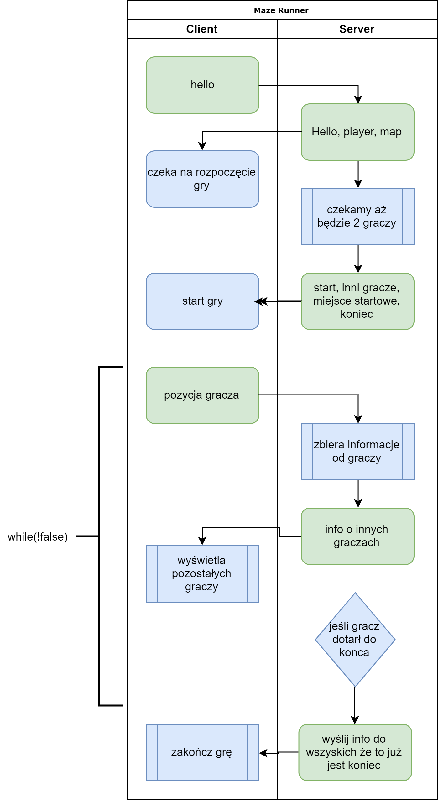

# Maze-runner

### Message types:

| Code | Description | Content |
| --- | --- | --- |
| 0x00 | hello | - from player |
| 0x01 | whoami | player id assigned by server |
| 0x02 | map | map data |
| 0x03 | endpoint | endpoint position |
| 0x04 | players | number of all players |
| 0x05 | start | - from server |
| 0x06 | player position | player position - send by player |
| 0x07 | other player pos | other players position - send by server |
| 0x08 | player end | from player - reached endpoint |
| 0x09 | server end | from server to all players about winner |

### Protocol Frame diagram

### Communication diagram

